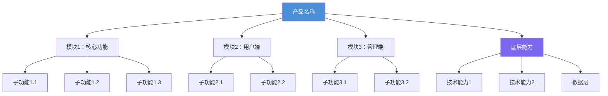
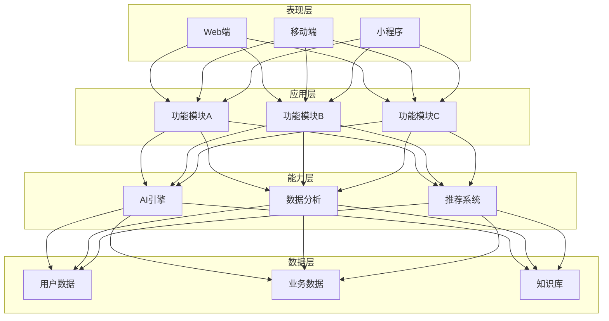
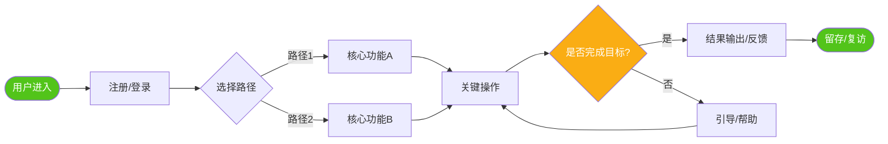
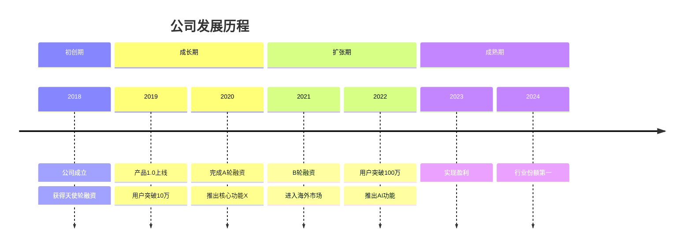
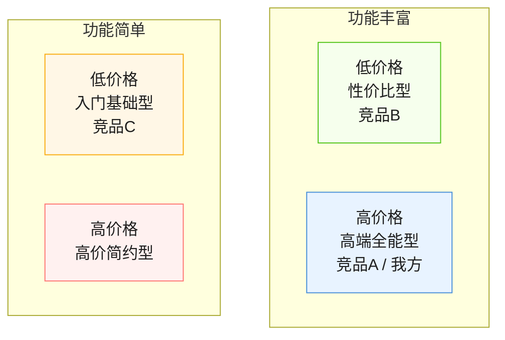
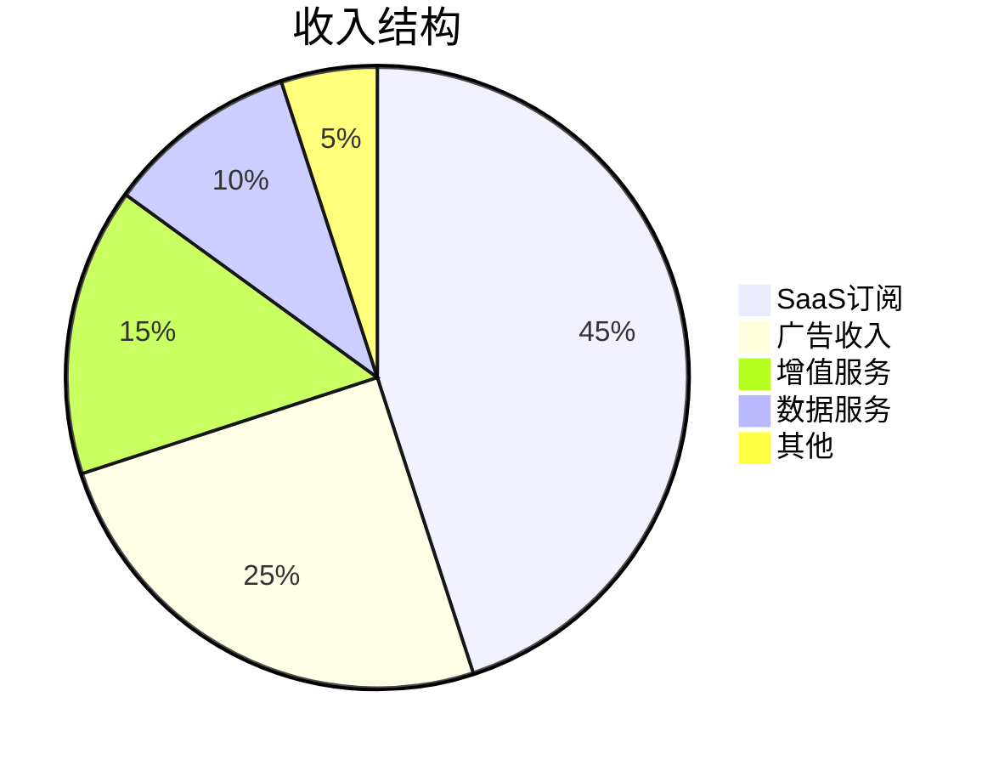
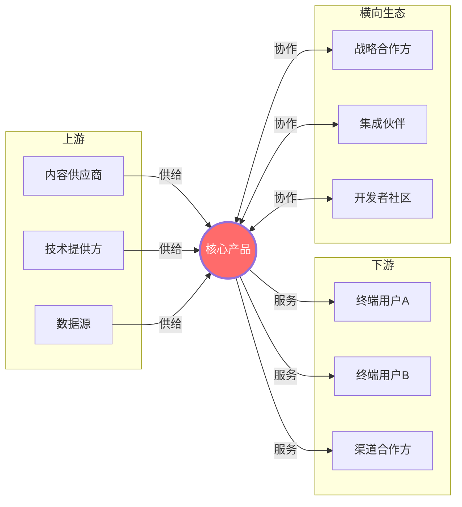
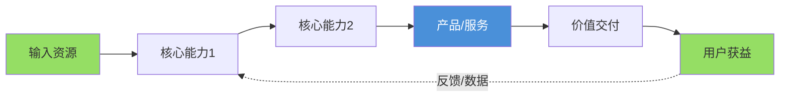

# 可视化图表规范（Mermaid）

报告中的图表统一使用 Mermaid 语法，可在 Typora、VS Code、GitHub 等主流 Markdown 渲染器中直接显示。生成图表时根据实际收集到的信息填充内容，不要生造数据。如果某个图表所需信息不足，跳过该图表而非填充占位符。

## 目录

1. [产品架构图](#1-产品架构图)
2. [用户核心流程图](#2-用户核心流程图)
3. [发展历程时间线](#3-发展历程时间线)
4. [竞争定位图](#4-竞争定位图)
5. [收入结构图](#5-收入结构图)
6. [生态关系图](#6-生态关系图)
7. [功能雷达图](#7-功能雷达图)
8. [价值链流程图](#8-价值链流程图)

---

## 1. 产品架构图

**用途**：展示产品的模块层次结构和各子系统之间的关系。适用于单品拆解的"产品矩阵"和"核心功能拆解"部分。

**为什么需要这个图**：表格只能列出功能清单，但无法传达模块之间的从属关系和协作逻辑。架构图让读者一眼看懂产品是怎么"搭"起来的。



**变体——分层架构图**（适用于有明确层次的产品）：



---

## 2. 用户核心流程图

**用途**：展示用户的关键操作路径，体现产品的核心体验闭环。适用于"产品架构与体验"部分。

**为什么需要这个图**：文字描述用户流程容易遗漏步骤或含糊不清。流程图强制你把每一步都画出来，能暴露体验断点和效率瓶颈。



---

## 3. 发展历程时间线

**用途**：可视化公司/产品的关键里程碑。适用于"发展历程"和"产品发展节奏"部分。



**注意**：如果渲染器不支持 `timeline`，可改用表格 + 竖线符号的 ASCII 时间线作为降级方案：

```
2018 ──── 公司成立 · 天使轮融资
  │
2019 ──── 产品1.0上线 · 用户10万+
  │
2020 ──── A轮融资 · 推出核心功能X
  │
2021 ──── B轮融资 · 进入海外市场
```

---

## 4. 竞争定位图

**用途**：在二维坐标中展示各竞品的市场定位差异。适用于多品对比的"产品定位分析"部分。

**为什么需要这个图**：表格列出各家定位后，读者需要自己在脑中比较差异。定位图把差异变成空间距离，一眼就能看出谁和谁直接竞争、哪里有市场空白。



上方代表功能更丰富，下方代表功能更简单；左侧代表低价格，右侧代表高价格。

**坐标轴选择建议**（根据行业灵活调整）：

- SaaS：功能丰富度 vs 定价水平
- 电商：品类广度 vs 服务深度
- 教育：内容深度 vs 覆盖广度
- 消费品：价格 vs 品牌调性

---

## 5. 收入结构图

**用途**：展示公司/竞品的收入来源构成。适用于"盈利模式"部分。



**多竞品对比时**，为每个竞品各画一个饼图，并排展示差异。如果具体占比数据未公开，标注"预估"并说明依据。

---

## 6. 生态关系图

**用途**：展示公司的合作伙伴、上下游关系、生态布局。适用于"商业模式分析"和"组织与战略"部分。



---

## 7. 功能雷达图

**用途**：多竞品在核心维度上的综合能力对比。适用于"核心功能对比"的总结部分。

Mermaid 暂不原生支持雷达图，使用以下文本替代方案：

```
功能雷达对比（1-5分制）

              竞品A  竞品B  竞品C
功能丰富度    ████▌  ███▌   ████
用户体验      ████   ████▌  ███
技术架构      ███▌   ████   ████▌
生态开放度    ██▌    ████   ███
定价竞争力    ████   ███    ████▌
服务支持      ███▌   ████▌  ███

█ = 1分   ██ = 2分   ███ = 3分   ████ = 4分   █████ = 5分
```

评分须基于报告中已有的分析结论，不凭空打分。每个维度旁简要标注评分依据。

---

## 8. 价值链流程图

**用途**：展示产品的核心价值创造流程，从输入到输出。适用于单品拆解的"整体战略与布局"部分。



---

## 使用原则

1. **信息充分才画图**：图表是用来提炼和可视化已有信息的，不是用来填充页面的。如果某个维度的信息只有一两句话，用文字比画图更合适
2. **每个图都要有分析**：图表后面必须跟一段分析文字，说明"这个图在告诉我们什么"。只放图不分析等于没分析
3. **数据标注来源**：图表中如果涉及具体数字（收入占比、市场份额等），在图表下方标注数据来源和时间
4. **不要重复表格内容**：如果某个信息已经用表格呈现得很清楚了，不需要再画一个图。图表和表格互补，不重叠
5. **降级兼容**：如果用户的 Markdown 渲染器不支持 Mermaid，图表应该可以被忽略而不影响报告的完整性——所有关键信息仍然在文字和表格中
